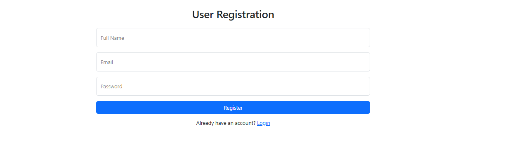
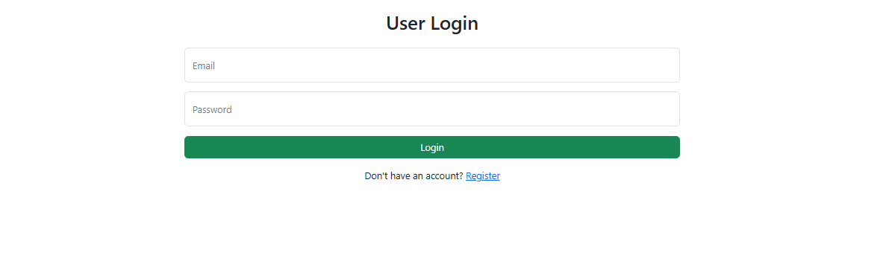
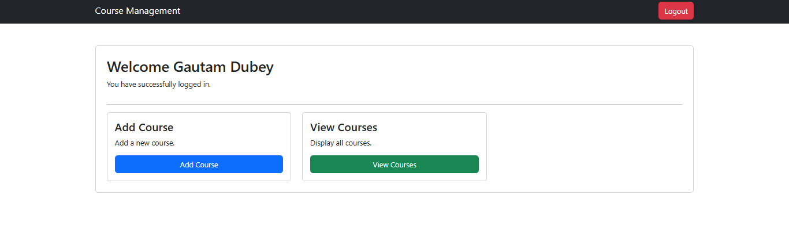
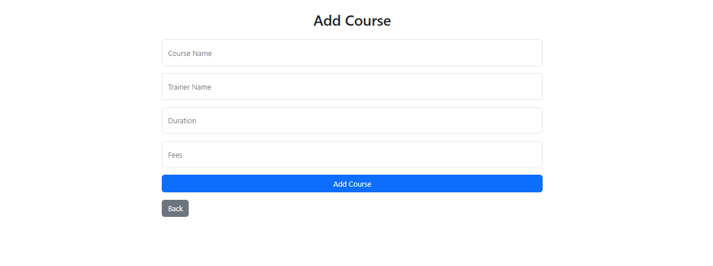
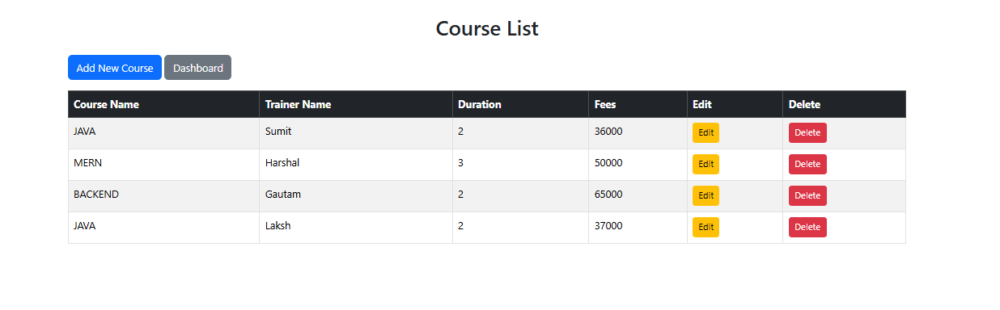
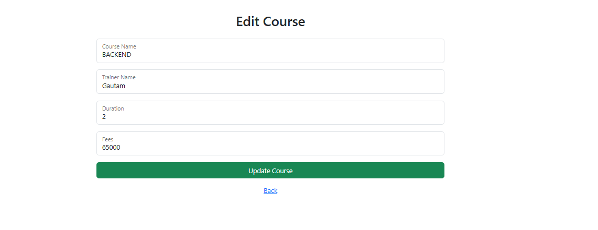
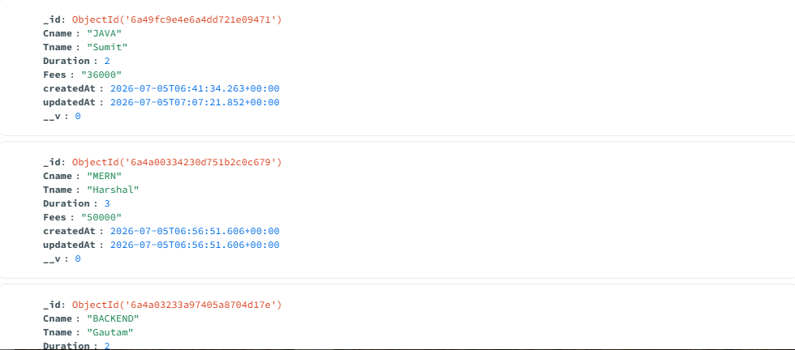
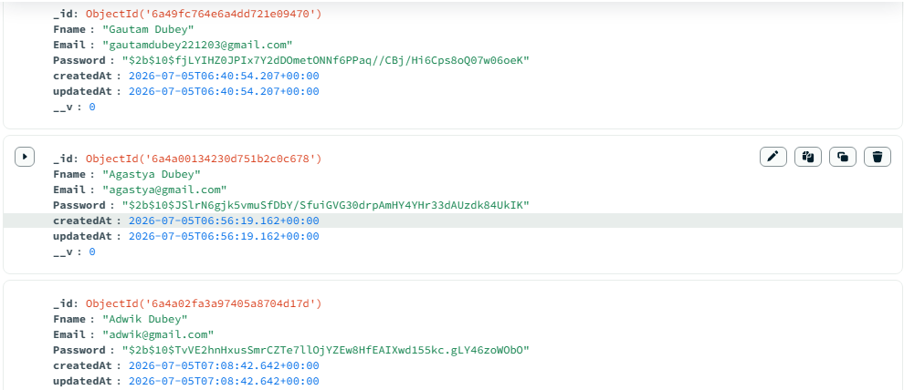

# 📚 Online Course Management System

## 📌 Project Objective

The **Online Course Management System** is a web application developed using **Node.js, Express.js, MongoDB, Mongoose, EJS, Bootstrap, MVC Architecture, and Express Session**.

This project allows users to register, log in securely, manage sessions, and perform complete CRUD (Create, Read, Update, Delete) operations on course records.

---

# 🚀 Technologies Used

- Node.js
- Express.js
- MongoDB
- Mongoose
- EJS
- Bootstrap 5
- Express Session
- Method Override
- MVC Architecture
- Git
- GitHub

---

# ✨ Project Features

### 👤 User Module

- User Registration
- User Login
- Password Encryption using Bcrypt.js
- Session Management
- Logout

### 📚 Course Module

- Add Course
- Display Courses
- Update Course
- Delete Course

---

# 📂 Project Structure

```
Online-Course-Management-System
│
├── Controller
│   ├── userController.js
│   └── courseController.js
│
├── Model
│   ├── userModel.js
│   └── courseModel.js
│
├── Router
│   ├── userRouter.js
│   └── courseRouter.js
│
├── views
│   ├── register.ejs
│   ├── login.ejs
│   ├── dashboard.ejs
│   ├── addCourse.ejs
│   ├── displayCourse.ejs
│   └── editCourse.ejs
│
├── Screenshots
├── app.js
├── db.js
├── package.json
├── package-lock.json
└── README.md
```

---

# ⚙ Installation Steps

### Clone Repository

```bash
git clone https://github.com/gautamdubey2212/Online-Course-Management-System.git
```

### Move into Project Folder

```bash
cd Online-Course-Management-System
```

### Install Dependencies

```bash
npm install
```

### Run Project

```bash
node app.js
```

or

```bash
nodemon app.js
```

Open Browser

```
http://localhost:4000
```

---

# ▶ How to Run the Project

1. Register a new user.
2. Login using Email and Password.
3. Dashboard page will open.
4. Add a new Course.
5. Display all Courses.
6. Edit Course Details.
7. Delete Course.
8. Logout.

---

# 📷 Project Screenshots

## 📝 User Registration Page



---

## 🔐 User Login Page



---

## 🏠 Dashboard



---

## ➕ Insert Course



---

## 📋 Display Courses



---

## ✏ Update Course



---

## 🍃 MongoDB Database Collections

### Users Collection



### Courses Collection



---

## 📁 GitHub Repository Structure

> Add the GitHub repository screenshot here after uploading the project.

```text
Example:
Screenshots/GitHubRepo.png
```

After taking the screenshot, replace the above text with:

```md

```

---

# 📊 Database

The project uses **MongoDB** to store application data.

Collections:

- Users
- Courses

---

# 🏗 MVC Architecture

This project follows the **MVC (Model View Controller)** architecture.

- **Model** → Database Schema
- **View** → EJS Pages
- **Controller** → Business Logic
- **Router** → Route Handling

---

# 📌 GitHub Repository

https://github.com/gautamdubey2212/Online-Course-Management-System

---

# 👨‍💻 Developed By

**Gautam Dubey**

---

# ✅ Project Status

**Completed Successfully ✔**
